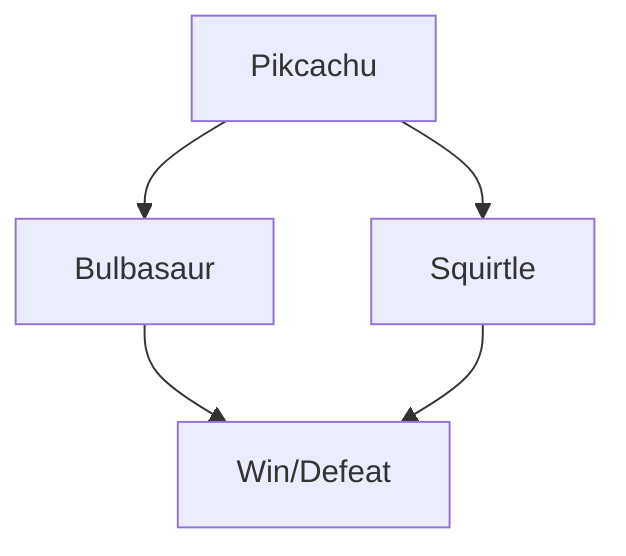

# Pokemon Battle

This code is created to learn Python, you can see an automatic pokemon battle, this code is free to modify, you can do some of this things.

  - Create options request for attack , the user can write an attack and the app responds random.
  - Create an graphic interface.
  - Pokemons Levels (This value affect directly the attack, PH, SP and )
  - Typical paper rock scissors game of pokémon (That means the attack depend the pokémon type).

# Features!

We have two pokémons and python selects a random pokemon The pokémon attacks with a random attack between tackle or an special attack, you only see how win, all pokémons has a min attack (6) and max attack (10) and this is a random value, bettween both, to this we add a complement dependent of the level of the Pokemon:

  | Pokemons | Attack Comp| MP|HP|
| ------ | ------ |------|-----|
| Pikachu | +20|60|100|
| Bullbasaur | +20 |60|90|
| Squirtle | +20 |50|80|

## UML diagrams

UML diagrams test.

