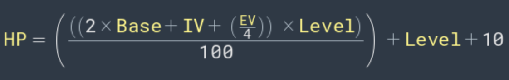

# Pokemon Battle

This phase of the code make the calc of the principal stats of each pokemon, based in the equations that uses Base stats, IV (Individual Stats), EV (Equip Stats).

The ecuation for the calc of HP:

The ecuation for other stats:

