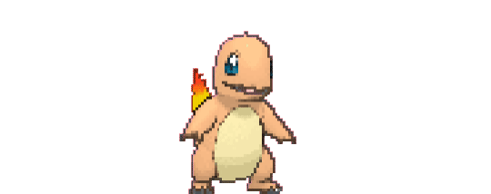

# Pokemon Battle

This phase of the code is na extension of Phase 2, it's includes the damage calculation and modifiers including the STAB added at third generation of pokémon.

The ecuation damage calculation:

The ecuation for modifiers:

Form more info let's check [this link at bulbapedia](https://bulbapedia.bulbagarden.net/wiki/Damage#Damage_calculation)

